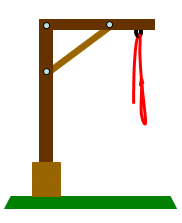
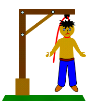
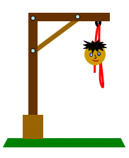
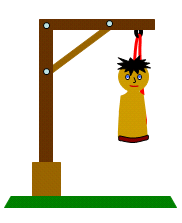
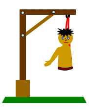
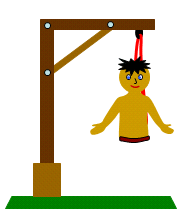
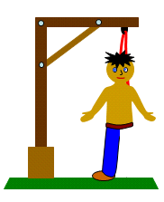

# Documentacion Ahorcado

## Se muestra el código html generado para el juego.

```html
<!DOCTYPE html>
<html lang="es">
<head>
    <meta charset="UTF-8">
    <meta name="viewport" content="width=device-width, initial-scale=1.0">
    <link rel="stylesheet" href="assets/css/style.css" type="text/css">
    <title>Ahorcado</title>
</head>
<body>
    <div class="contenedor">
        <div id="resultado"></div>
        <div id="imagen"></div>
        <div id="palabra"></div>
        <input type="text" name="display" id="display" minlength="1" maxlength="">
        <button id="btnComprobar" value="Comprobar" name="Comprobar">Comprobar</button>
        <form action="index.html" method="post">
            <button type="submit" >Volver a jugar</button>
        </form>
    </div>
    <script src="js/ahorcado.js"></script>
</body>
</html>
```

## Descripción de cada elemento relevante en el html:

El siguiente div, almacenará el resultado obtenido por el jugador, es decir, se "rellenará" con "has ganado"/"has perdido" en función de si el jugador adivina la palabra o por el contrario agota todos los intentos.

```html
    <div id="resultado"></div>
```

En el siguiente div, se irá cargando la imagen correspondiente al numero de fallos que cometa el usuario.

```html
    <div id="imagen"></div>
```

Este div contendrá la "palabra" en forma de guiones o letras adivinadas en función de los que introduzca el jugador.

```html
    <div id="palabra"></div>
```

El siguiente elemento input:text, será donde el jugador podrá introducir letra por letra o bien resolver la palabra a adivinar.
Y el elemento "button" hará la funcion de comprobar la entrada por teclado.

```html
   <input type="text" name="display" id="display" minlength="1" maxlength="">
   <button id="btnComprobar" value="Comprobar" name="Comprobar">Comprobar</button>
```

Por último, un formulario con un elemento input:submit que hará la funcion de recargar la pagina para que el jugador pueda volver a jugar, generando así una nueva palabra a adivinar.

```html
<form action="index.html" method="post">
    <button type="submit" >Volver a jugar</button>
</form>
```

## Descripción del archivo ahorcado.js, donde se encuentra la funcionalidad del juego en código JavaScript

A continuación, se muestra la declaracion de variables que corresponden a cada uno de los elementos HTML que vamos a necesitar "manipular":

```js
/* Varible del display */
const display = document.getElementById("display");
/* Variable de boton comprobar */
const btnComprobar = document.getElementById("btnComprobar");
/* Variable del div donde se muestra la palabra */
const palabraJugada = document.getElementById("palabra");
/* variable para modificar div que contiene las imagenes */
const divImagenes = document.getElementById("imagen");
/* varibale del div que muestra el resultado de la partida */
const divResultado = document.getElementById("resultado");
```

Después de la declaración de las variables anteriores, vamos a crear un objeto/Clase que contendrá sus propios atributos y metodos que le añaden funcionalidad al juego. Nuestra clase se llamará como el juego "Ahorcado". Se ha optado por la declaración de clases introducida en ES6.

- Los atributos de clase son:
    - ***Numero maximo de intentos***, inicializado a 7.
    - ***Array de palabras***, donde se almacenan todas las posibles palabras a adivinar.
    - ***PalabraRandom*** es la palabra que será generada aleatoriamente. Se inicializa vacia. 
    - ***Array de letras***, se almacenarán las letras de la palabra generada
    - ***Array a mostrar***, es el array que mostraremos al jugador con un numero de guiones igual al de la palabra generada.
    - ***divImagenes.InnerHTML*** se inicializa con la primera imagen del ahorcado, donde se puede ver la horca sin muñeco.

```js 
class Ahorcado {
    /* Constructor */
    constructor() {
        this.intentos = 7; //intentos por partida maximo
        this.arrayPalabras = ["ASUS", "APPLE", "AORUS", "GIGABYTE","HP", "ACER","BENQ","LENOVO","LOGITECH"]; // almacena todas las palabras del juego
        this.palabraRandom = '';
        this.arrayDeletras = '';
        this.arrayAmostrar = [];//almacena los campos que tendra la palabra a mostrar
        divImagenes.innerHTML = "";
    }
...
```

Una vez tenemos declarado el constructor paso a detallar cada uno de los metodos de la clase que se llamarán automaticamente para "rellenar" los atributos de clase tales como la palabra aleatoria.

- Método ***fPalabraAleatoria***, se encarga de extraer de manera aleatoria una palabra del array donde se encuentran todas las palabras del juego. Para generar esa palabra, se necesita un numero random que este dentro de la longitud del array, de esta manera obtenemos una posicion que emplearemos para sacar la palabra y asignarla al atributo de clase ***this.palabraRandom*** como se muestra en el codigo de abajo.
Por ultimo hacemos una llamada al metodo de la clase ***this.fSepararEnLetras()***.

```js
/* Metodo que extrae una palabra aleatoria del arrayPalabras y la asigna al atributo palabraRandom */
fPalabraAleatoria = () => {
    let posicionRandom = Math.floor(Math.random() * this.arrayPalabras.length);//posicion aleatoria del array de palabras
    this.palabraRandom = this.arrayPalabras[posicionRandom];//Palabra aleatoria
    this.fSepararEnLetras();
}
```

- Método ***fSepararEnLetras***, será el encargado de separar en letras el string que contiene el atributo ***this.palabraRandom***, para ello hacemos uso de la funcion ***split*** con el parametro vacio (''), el resultado de este metodo será un array el cual es asignado al atributo de clase ***this.arrayDeletras***.
Por último, se hace una llamada al metodo ***this.fGeneraArrayAmostrar***.

```js
/* funcion que separa la palabra random en un array de letras */
fSepararEnLetras = () => {
    this.arrayDeletras = this.palabraRandom.split('');//La palabra se convierte en array de letras
    this.fGeneraArrayAmostrar();
}
```

- Método ***fGeneraArrayAmostrar***, se encarga de asignar al atriubuto de clase ***this.arrayAmostrar*** un array con las mismas posiciones-longitud que la palabraRandom, este es el array que mas tarde mostraremos al jugador. Para ello, se recorre el array de letras ya generado, y por cada posicion introduciremos en un nuevo array " _ ", con el metodo ***push*** para indicar que ahi va una letra.
Una vez hemos generado el array lo asignamos al atributo de clase ***this.arrayAmostrar***.

```js
/* se genera el array a mostrar para esa palabra */
fGeneraArrayAmostrar = () => {
    let array = [];
    for (const letra of this.arrayDeletras)
        array.push(' _ ');
    this.arrayAmostrar = array;
}
```

A continuación de describe la funcion que comprueba si la letra introducida por el jugador se encuentra en el array de letras, o si la palabra introducida es igual a la que debe adivinar. Se describe paso a paso:

- Solo se ejecutará la funcionalidad si el numero de intentos es mayor a 0.

```js
    fComprobar = () => {
        if (this.intentos > 0) {
```

- Si la condicion se cumple, primero evaluamos si lo introducido por el jugador tiene una longitud mayor a 1, es decir, ha intentado resolver. Despues comprueba si se corresponde a la palabra entera. Además para eliminar posibles espacios en blanco a izquierda y derecha antes hemos hecho uso de la funcion ***trim***. El valor recogido se asigna a la variable ***elemento*** para poder marnejarlo mejor y resetear el ***display***. Si la palabra es igual a la palabraRandom, hacemos una llamada a la funcion ***fMostrar***, pasandole por parametro la variable ***elemento***. Si la palabra no es adivinada, llmamos a la funcion ***finDePartida*** y mostramos la imagen del muñeco ahorcado.

```js
let elemento = display.value.trim();//Elimina posibles espacios en blanco
display.value = ''; //resetea el valor del display
    if (elemento.length>1) {
        if (elemento.toUpperCase() === this.palabraRandom.toUpperCase())
            this.fMostrar(elemento);
        else{
            this.fFinDePartida();
            divImagenes.innerHTML = "";
        } 
```

- Si la condicion antes descrita no se cumple, se ejecutará el segundo bloque, donde:

    - Se recorre el array de letras para comprobar si el elemento está presente, en cuyo caso modificaremos el array a mostrar:

    ```js
    }else{
        for (const [posicion, letra] of this.arrayDeletras.entries()) {
            if (letra.toLocaleLowerCase() === elemento.toLocaleLowerCase())
                this.arrayAmostrar[posicion] = letra; //Se cambia _ por la letra correspondiente    
        }
    ```

    - Después se evalua si el elemento no está en el array de letras con la funcion ***includes***, en caso de no estar presente, se decrementara el atributo que guarda el numero de intentos y cargará la imagen correspondiente al numero de fallos, en caso de llegar a un numerod e fallo igual a 1 se llmará a la funcion ***fFinDePartida***.

    ```js
        if (!this.arrayDeletras.includes(elemento.toUpperCase())){
            this.intentos--;
            switch (this.intentos) {
                case 6:
                    divImagenes.innerHTML = "";
                    break;
                case 5:
                    divImagenes.innerHTML = "";
                    break;
                case 4:
                    divImagenes.innerHTML = "";
                    break;
                case 3:
                    divImagenes.innerHTML = "";
                    break;
                case 2:
                    divImagenes.innerHTML = "";
                    break;
                default:
                    divImagenes.innerHTML = "";
                    this.fFinDePartida(); //funcion que muestra al jugador que ha perdido
                    break;
            }
        }
    ```

    - Por ultimo, se hace una llamada al metodo ***FMostrar*** y se termina el metodo ***fComprobar***.

    ```js
        this.fMostrar();
            }
        }
    }
    ```

- Método ***fMostrar***, en la primera parte del metodo se encarga de "cargar" en el div con id="palabra" el contenido de ***palabraCompleta*** o en su defecto ***this.arrayAmostrar***.
En caso de acierto aparecerá la letra o palabra, las letras-posiciones que aun no hayan sido adivinadas aparecerá " _  ". En la segunda parte del metodo se comprueba si ***palabraRandom*** es igual a ***palabraCompleta*** en caso de que exista, o que sea igual a la palabra resultante de unir ***arrayAmostrar***, en cuyos casos rellenaremos el div con id="resultado" con el mensaje "Has ganado!".

```js
/* Funcion que introduce en el div con id=palabra el contenido de aciertos y _ */
fMostrar = (palabraCompleta = this.arrayAmostrar) => {
    let caja = "<p>";
    for (const letra of palabraCompleta) {
        caja += letra.toUpperCase();
    }
    caja += "</p>";
    palabraJugada.innerHTML = caja;

    /* COmprobacion - Salida si la palabra o el array es igual a la palabraRAndom */
    if (this.arrayAmostrar.join('').toUpperCase() === this.palabraRandom.toUpperCase()) 
        divResultado.innerHTML = "Has ganado!!😎";
    else if(typeof palabraCompleta === 'string') {
        if (palabraCompleta.toLocaleLowerCase() === this.palabraRandom.toLocaleLowerCase()) 
            divResultado.innerHTML = "Has ganado!!😎";
    }
};
```

- El ultimo metodo de la clase Ahorcado es ***fFinDePartida***, el cual se encarga de rellenar el div con id="resultado" con el mensaje "Has perdido".

```js
fFinDePartida = () => {
    divResultado.innerHTML = "Has perdido ☹️";
};
}
```

En el siguiente bloque se muestra la creacion de un nuevo objeto de la clase ahorcado llamado partida, y a través de este la llamada al metodo que autogenera y rellena algunos de los atributos del objeto.

```js
const partida = new Ahorcado();
partida.fPalabraAleatoria();
partida.fMostrar();
```

Por ultimo, se muestra el evento asociado a la variable btnComprobar, el cual al ser pulsado se llamara a al metodo del objeto partida ***fComprobar*** 

```js
/* Evento de boton comprobar */
btnComprobar.addEventListener("click", function () { partida.fComprobar() });
```